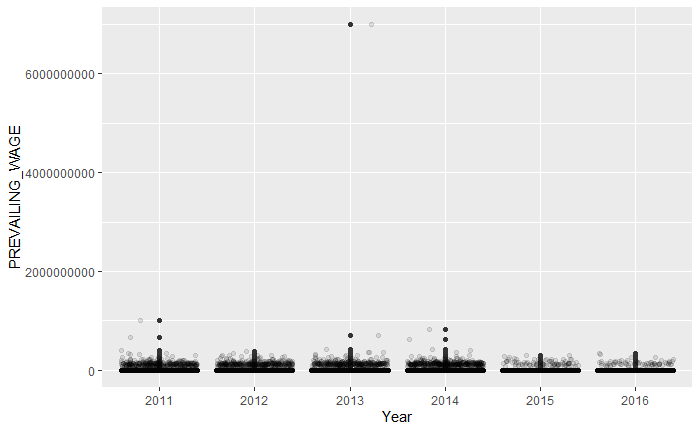
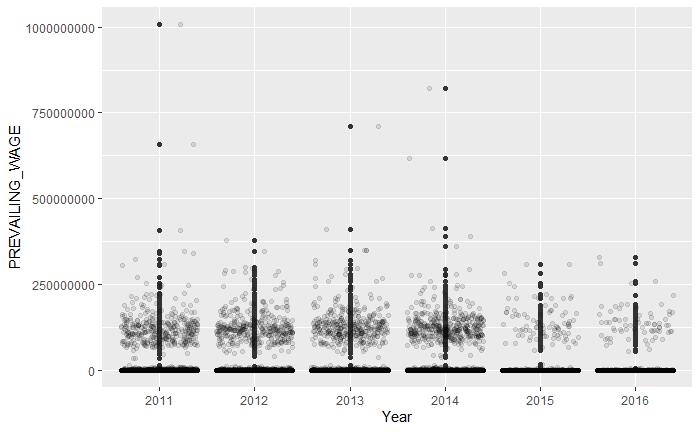
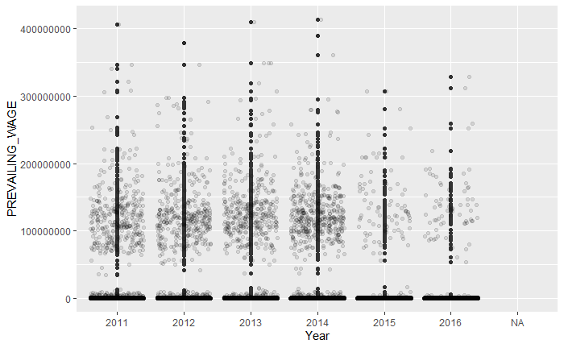
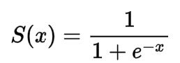

```{r setup, include=FALSE}
knitr::opts_chunk$set(echo = TRUE, message = FALSE,
                      warning = FALSE)
```

# Predicting the Case Status of H1B

## 1.0 Introduction

The H-1B is a visa in the United States that allows U.S. employers to temporarily employ foreign workers in specialty occupations. Only a fix amount of around 100,000 H1B will be issued each year. This number might sounds huge, but its extremely high demand have turned this visa lottery into a really competitive one. According to the official website of [U.S. Citizenship and Immigration Service](https://www.uscis.gov/working-in-the-united-states/temporary-workers/h-1b-specialty-occupations-and-fashion-models/h-1b-electronic-registration-process#:~:text=For%20FY%202023%2C%20we%20received,when%20and%20where%20to%20file.), 483,927 registrations for H-1B was received for 2023, and only 127,600 was issued. H-1B is crucial for any foreigner that wants to become a Permanent Resident of the U.S., for it allows you to enroll the green card lottery. However, if you lose your H-1B status because of any working status changes before obtaining a green card, you are only given 2 month to get a new job and restore your status. Otherwise you will be kicked out of the country :(.

For any international student who would like to stay in the U.S. after their graduation, getting a job and obtaining H-1B Visa becomes a very popular option. However, it also means that students have to compete with other potential immigrants that has more outstanding work skills. For undergraduate, only 65,000 new H-1B visas granted each year. It is already hard enough for a student to get into a company that sponsor H1B, not to mention passing the H-1B lottery. Therefore, by studying the H-1B applications throughout passing years, I want to provide a prediction on the **case stautus** of H-1B visas. I hope the resulting model can serve as a guideline for international students who want to plan their career carefully in the U.S.

The data I use for training is [H-1B Visa Petitions 2011-2016](https://www.kaggle.com/datasets/nsharan/h-1b-visa) from Kaggle. This is a huge database that has roughly 3,000,000 observations. To address this classification question, I fit four models, which are KNN, logistic regression, elastic net, and random forest.

{width="363"}

## 2.0 Environment Setting

Load library and set seed.

```{r}
library(tidymodels)
library(ISLR)
library(ISLR2)
library(tidyverse)
library(glmnet)
library(modeldata)
library(ggthemes)
library(janitor) 
library(naniar)
library(corrplot) 
library(patchwork)
library(forcats)
library(ranger)
library(vip)
library(gsubfn)
library(themis)
tidymodels_prefer()

set.seed(1256)
```

Import original data.

```{r}
data <- read.csv("h1b_kaggle.csv")
head(data)
```

## 3.0 Data tidy-up

Before we put the data into models, we need to tidy up it to omit any *NAs* and make sure it contains information we need. I checked every predictors we have in the data set, and determined how to handle them individually. We currently have 11 predictors here, which are:

1.  **`X`**: ID for each applications
2.  **`Case_statues`**: our outcome variable. There are four main status, which are Certified, Certified-Withdrawn, Withdrawn, Denied. Among the four status, Certified-Withdrawn means that immigration department had pass the H-1B application, but it is later withdrawn by the company. Withdrawn means that the H-1B application is withdrawn before the immigration department making decision. The ideal outcome is Certified.
3.  **`Employer_name`**: the name of the companies.
4.  **`Soc_name`**: Its full name is Standard Occupational Classification System, which is a United States government system of classifying occupations.
5.  **`Job_title`**: Job title.
6.  **`Full_time_position`**: This tells whether a job is full-time or not. Y stands for full-time and N stands for part-time.
7.  **`Prevailing_wage`**: The estimate wage of the position.
8.  **`Year`**: The year when the H-1B applied.
9.  **`Worksite`**: City of the worksite.
10. **`Ion`**: Longitude of worksite
11. **`lat`**: Latitude of worksite.

Firstly, let's check the total amount of *NAs*:

```{r}
data %>% summarise_all(~ sum(is.na(.)))
```

Notice that we have NAs for all predictors except X and worksite. How to handle these *NAs* and the predictors itself are evaluated below.

### 3.1 X

X will not serve as a predictors. Therefore there is no need to change anything about it.

### 3.2 Case Status

Firstly, let's check what case status are in the data and their percentage.

```{r}
options(scipen=999) # to remove scientific notations
data %>% 
  group_by(CASE_STATUS) %>%
  summarise(count = n(),percentage = 100*count/(dim(data)[1]))
```

Notice that 87.12% of the data has a case status as certified, following by certified-withdrawn at 6.75%, denied at 3.14%, and withdrawn at 2.99%. Anything other than these four statues has percentage less than 0.001%.

Therefore, I plan to drop Invalidated, Pending, Rejected, and *NAs* since they won't help in building model.

```{r}
data <- data[data$CASE_STATUS != "INVALIDATED" & data$CASE_STATUS != "PENDING QUALITY AND COMPLIANCE REVIEW - UNASSIGNED" & data$CASE_STATUS != "REJECTED", ]
data <- data %>% 
  drop_na(CASE_STATUS) %>% 
  mutate(CASE_STATUS = factor(CASE_STATUS))

data %>% 
  group_by(CASE_STATUS) %>%
  summarise(count = n(),percentage = 100*count/(dim(data)[1]))
```

After tidy-up, the data now contains only the four desired case status. Notice that certified has a extreme large ratio compare to other 3 status. It will be downsampled when preparing the recipe.

### 3.3 Employer name

Although it looks like an ID, there exist the possibility that an application submitted by a big company is more likely to pass compare to the application from a small one. Therefore, this may need to be considered as a predictor.

```{r}
data$EMPLOYER_NAME <- gsub("[^[:alnum:]]", "",data$EMPLOYER_NAME) #tidy text by removing all punctuation.
data %>% 
  group_by(EMPLOYER_NAME) %>%
  summarise(count = n(),percentage = 100*count/(dim(data)[1]))
```

However, after tidy up there is still too many variance. For most of the company, the H-1B application they submitted throughout the year is less than 10. This is not an ideal situation for using fct_other, for "other" will have a significant amount compare anything remaining. Therefore I decieded to treat it as a ID.

### 3.4 Soc name/Job title

These two predictors carry very similar information. Since Soc is the standardized name for job, I plan to use it and omit Job title. I noticed that it contains more missing data compare to job title, so I pull out missing ones here to check.

```{r}
missing_soc <- filter(data, is.na(data$SOC_NAME))
head(missing_soc)
```

It turns out there should be a matching soc for these job title. I am also curious about their certified rate if there is a missing part in soc.

```{r}
missing_soc %>% 
  group_by(CASE_STATUS) %>%
  summarise(count = n(),percentage = 100*count/(dim(missing_soc)[1]))
```

The certified rate are still pretty high and similar to the ratio in the original data. Then it is safe to drop the NAs and keep soc name as a predictor.

```{r}
data$SOC_NAME <- toupper(data$SOC_NAME) #capitalize all 
data$SOC_NAME <- gsub("[^[:alnum:]]", "",data$SOC_NAME) #remove punctuation
data <- data %>% 
  drop_na(SOC_NAME) %>% 
  mutate(SOC_NAME = factor(SOC_NAME))
```

The components of soc name is also checked.

```{r}
data %>% 
  group_by(SOC_NAME) %>%
  summarise(count = n(),percentage = 100*count/(dim(data)[1]))
```

Soc name that shows up less than 1% is grouped into "other".

```{r}
data <- data %>%
  mutate(SOC_NAME = fct_lump_prop(SOC_NAME, 0.01))
```

```{r}
data %>% 
  group_by(SOC_NAME) %>%
  summarise(count = n(),percentage = 100*count/(dim(data)[1]))
```

Now we have only 18 categories on Soc name.

### 3.5 Full time position

Let's check the portion of the response.

```{r}
data %>% 
  group_by(FULL_TIME_POSITION) %>%
  summarise(count = n(),percentage = 100*count/(dim(data)[1]))

```

Since there is only 2 observations that has NA for this predictor, I decided to drop it.

```{r}
data <- data %>% 
  drop_na(FULL_TIME_POSITION) %>% 
   mutate(FULL_TIME_POSITION = factor(FULL_TIME_POSITION))

```

### 3.6 Prevailing Wage

This is the only numeric predictor here. I want to see how it is distributed.

```{r, eval=FALSE}
ggplot(data, aes(factor(YEAR), PREVAILING_WAGE)) +
  geom_boxplot() + 
  geom_jitter(alpha = 0.1) +
  xlab("Year") #This code took too long to knit. I attached the resulting picture separately
```



Looks like there are some outliers that exceeds 6,000,000,000. Let's pull it out to check.

```{r}
outliers <- data[which(data$PREVAILING_WAGE>2000000000),]
outliers
```

This data is clearly a miss typed one. Let's drop it and run the boxplot again.

```{r}
data <- data[data$X != 2163249, ]
```

```{r, eval=FALSE}
ggplot(data, aes(factor(YEAR), PREVAILING_WAGE)) +
  geom_boxplot() + 
  geom_jitter(alpha = 0.1) +
  xlab("Year")
```

 There are still a few outliers here gerater than 500,000,000. Let's pull it out to check.

```{r}
outliers2 <- data[which(data$PREVAILING_WAGE> 500000000),]
outliers2
```

The prevailing wage are really not reasonable. Noticed that they all denied. It is safe to drop them.

```{r}
data <- data[data$PREVAILING_WAGE < 500000000, ]
```

```{r, eval=FALSE}
ggplot(data, aes(factor(YEAR), PREVAILING_WAGE)) +
  geom_boxplot() + 
  geom_jitter(alpha = 0.1) +
  xlab("Year")
```

 Now the data looks more reasonable. It is polarized towards either side: some people has a wage around 100,000,000, but the majority earn less than 1,000,000 and pull the average down. \### 3.7 Year

Years are factorized and *NAs* are dropped.

```{r}
data <- data %>% 
  drop_na(FULL_TIME_POSITION) %>%
  mutate(YEAR = factor(YEAR))
```

### 3.8 Worksite

It is composed in a format of "city, state". However, I don't think we need such a specific information. Instead, splitting them into 4 state census regions could be more helpful. I will first spite out the "state" part and then regourp them into west, midwest, northeast, and south. Any area other than these, such as Puerto Rico, will be categorized into "other". Notice that there is no missing data in worksite.

```{r}
data <- separate(data = data, col = WORKSITE, into = c("CITY", "STATE"), sep = ", ", remove = FALSE) #split workplace into city and state
```

```{r}
data <- data %>% 
  mutate(STATE = factor(STATE)) #factorize state

data <- data %>%
  mutate(REGION = forcats::fct_collapse(STATE,
                                        WEST = c("CALIFORNIA", "OREGON", "WASHINGTON", "IDAHO",
                                                 "MONTANA", "NEVADA", "WYOMING", "UTAH",
                                                 "COLORADO", "ARIZONA", "NEW MEXICO", "ALASKA",
                                                 "HAWAII"),
                                        MIDWEST = c("NORTH DAKOTA", "SOUTH DAKOTA", "NEBRASKA", "KANSAS",
                                                    "MINNESOTA", "IOWA", "MISSOURI", "WISCONSIN",
                                                    "ILLINOIS", "MICHIGAN", "INDIANA", "OHIO"),
                                        NORTHEAST = c("MAINE", "VERMONT", "NEW HAMPSHIRE", "MASSACHUSETTS",
                                                      "CONNECTICUT", "RHODE ISLAND", "NEW YORK", "PENNSYLVANIA",
                                                      "NEW JERSEY"),
                                        SOUTH = c("TEXAS", "OKLAHOMA", "ARKANSAS", "LOUISIANA",
                                                  "KENTUCKY", "TENNESSEE", "MISSISSIPPI", "ALABAMA",
                                                  "WEST VIRGINIA", "DELAWARE", "MARYLAND", "VIRGINIA",
                                                  "NORTH CAROLINA", "SOUTH CAROLINA", "GEORGIA", "FLORIDA",
                                                  "DISTRICT OF COLUMBIA"))) %>% 
  mutate(REGION = fct_other(REGION, keep = c("WEST", "MIDWEST", "NORTHEAST", "SOUTH")))
data %>% 
  group_by(REGION) %>%
  summarise(count = n(),percentage = 100*count/(dim(data)[1]))
```

### 3.9 Lon/Lat

Coded location for work site. We don't need these details about the worksite so they are not used as predictors.

After tidying up, there is 2,984,633 observation remains in the database. Although generally speaking more data means better model, such a huge amount of them may take centuries to run and eventually crush my laptop. Therefore, I took a stratified slice of the original data that contains 10,000 observations.

```{r}
h1b_data <- sample_n(data, 10000)
head(h1b_data)
write.csv(h1b_data, "h1b_data_sample.csv", row.names=TRUE)
```

## 4.0 Setting Up Models

### 4.1 Train/Test Split

I plan to use 90% of them as training data and 10% as testing data. I prefer a greater portion on training set because we also need to downsample the certified visa that is 87% of the total observations. This will further trim down the observation in training set.

```{r}
h1b_split <- initial_split(h1b_data, prop = 0.90, strata = "CASE_STATUS")
h1b_train <- training(h1b_split)
h1b_test <- testing(h1b_split)
```

### 4.2 Building Recipe

Based on my analysis of every variables in the database, the following 5 are chose as predictors: SOC_NAME, FULL_TIME_POSITION, PREVAILING_WAGE, YEAR, REGION. Four of them are factors and PREVAILING_WAGE is numeric.

```{r}
h1b_recipe <- recipe(CASE_STATUS ~ SOC_NAME + FULL_TIME_POSITION +  PREVAILING_WAGE + YEAR + REGION, data = h1b_train) %>% 
  step_dummy(all_nominal_predictors()) %>% 
  step_normalize(all_numeric_predictors()) %>%
  step_downsample(CASE_STATUS, under_ratio = 3)
```

### 4.3 K-Fold Cross Validation

A stratified cross validation is applied to the training set. Here I set k=5.

```{r}
h1b_folds <- vfold_cv(h1b_train, v = 5, strata = "CASE_STATUS")
```

## 5.0 Model fitting and Performance

For this part, I choose KNN, logistic regression, elastic net, and random forest for model fitting. We will be turning neighbors for KNN; mixture and penalty for elastic net; mtry, trees, min_n for random forest. Their performance will be evaluated based on area under ROC Curve. In other words, a bigger roc_auc means better model.

### 5.1 Model fitting

1.  K Nearest Neighbor

    K Nearest Neighbor, also known as KNN, is a supervised machine learning algorithm that estimates the likelihood a data point belongs to a group by locating and comparing the nearest k points. It can be used for solving both classification problem and regression problem. It required a manually set K to function. In the project, given that we have comparatively large data, it will be tuned in a range between 200 and 1200 under level of 10.

```{r}
knn_mod <- nearest_neighbor(neighbors = tune()) %>%
  set_mode("classification") %>%
  set_engine("kknn")

knn_wk <- workflow() %>% 
  add_model(knn_mod) %>% 
  add_recipe(h1b_recipe)

neighbors_grid <- grid_regular(neighbors(range = c(200, 1200)), levels = 10)

```

```{r, eval=FALSE}
tune_res_knn <- tune_grid(
  object = knn_wk, 
  resamples = h1b_folds, 
  grid = neighbors_grid)

save(tune_res_knn, file = "tune_res_knn.rda")
```

2.  Logistic Regression

    Logistic regression is a classification algorithm that fits the data into a Sigmoid function to output the probability between zero and one. No tuning is needed for it.



```{r}
lr_mod <- multinom_reg(penalty = 0) %>%
  set_mode("classification") %>%
  set_engine("glmnet")

lr_wk <- workflow() %>% 
  add_model(lr_mod) %>% 
  add_recipe(h1b_recipe)

lr_fit_val <- lr_wk %>% 
 fit_resamples(resamples = h1b_folds)

save(lr_fit_val, file = "lr_fit_val.rda")

```

3.  Elastic Net Regression\
    Elastic net regression is a regularized algorithm that uses the penalties from both the lasso and ridge techniques. In this project, the penalty and mixture will be tuned based on a regular grid with 10 levels each, both range from 0 to 1.

```{r}
en_mod <- multinom_reg(mixture = tune(), 
                              penalty = tune()) %>%
  set_mode("classification") %>%
  set_engine("glmnet")

en_wk <- workflow() %>% 
  add_recipe(h1b_recipe) %>% 
  add_model(en_mod)

en_grid <- grid_regular(penalty(range = c(0, 1),
                                     trans = identity_trans()),
                        mixture(range = c(0, 1)),
                             levels = 10)
```

```{r, eval=FALSE}
tune_res_en <- tune_grid(
  en_wk,
  resamples = h1b_folds, 
  grid = en_grid
)

save(tune_res_en, file = "tune_res_en.rda")
```

4.  Random Forest\
    Random forest consists of multiple individual decision tree models that are uncorrelated. The class labels picked by the most individual trees become the Random Forest model's prediction. Random forest requires a manual input of mtry, trees, and min_n. In this project, a grid with 5 levels is created for tuning. The tree size is tuned in the range between 50 and 200, and Min_n is tuned in the range between 20 to 50.

```{r}
rf_mod <- rand_forest(mtry = tune(), 
                           trees = tune(), 
                           min_n = tune()) %>%
  set_engine("ranger", importance = "impurity") %>% 
  set_mode("classification")

rf_wk <- workflow() %>% 
  add_model(rf_mod) %>% 
  add_recipe(h1b_recipe)

rf_grid <- grid_regular(mtry(range = c(1, 5)), 
                        trees(range = c(50, 200)),
                        min_n(range = c(20, 50)),
                        levels = 5)
```

```{r, eval=FALSE}
tune_res_rf <- tune_grid(
  rf_wk, 
  resamples = h1b_folds, 
  grid = rf_grid
)

save(tune_res_rf, file = "tune_res_rf.rda")

```

### 5.2 Model after tuning

```{r}

load("lr_fit_val.rda")
load("tune_res_en.rda")
load("tune_res_knn.rda")
load("tune_res_rf.rda")
```

1.  K Nearest Neighbors

```{r}
show_best(tune_res_knn, metric = "roc_auc")
best_neighbors <- select_by_one_std_err(tune_res_knn, desc(neighbors), metric = "roc_auc")
```

K = 533 has the best performance. Here roc_auc = 0.6095.

2.  Logistic Regression

```{r}
collect_metrics(lr_fit_val)
```

The logistic regression has roc_auc = 0.6124.

3.  Elastic Net Regression

```{r}
autoplot(tune_res_en)
```

```{r}
show_best(tune_res_en, n = 1)
best_en <- select_best(tune_res_en,
                          metric = "roc_auc",
                          penalty,
                          mixture
                          )
```

The best model is when penalty = 0 and mixture = 1. Here roc_auc = 0.6123.\
4. Random Forest

```{r}
autoplot(tune_res_rf) + theme_minimal()
```

```{r}
show_best(tune_res_rf, n = 1)
best_rf <- select_best(tune_res_rf)
```

Best random forest has mtry = 2, trees = 125, min_n = 42. The roc_auc = 0.6127.

### 5.3 Best Model

Although all four model has a very similar roc_auc of around 0.61, random forest does a slightly better prediction on 0.6127. The best random forest is fitted to the entire training set and has an outcome roc_auc = 0.7178 that is higher than its performance during cross validation.

```{r}
final_rf_model <- finalize_workflow(rf_wk, best_rf)
final_rf_model <- fit(final_rf_model, h1b_train)

final_rf_train <- augment(final_rf_model, 
                               h1b_train) %>% 
  select(CASE_STATUS, starts_with(".pred"))

roc_auc(final_rf_train, truth = CASE_STATUS, .pred_CERTIFIED:.pred_WITHDRAWN)
```

Throughout the importance diagram, it is obvious that prevailing wage is the most important predictor.

```{r}
final_rf_model %>% extract_fit_parsnip() %>% 
  vip() +
  theme_minimal()
```

Fitting the best random forest model into the testing set, it gives a resulting roc_auc of 0.6308.

```{r}
final_rf_test <- augment(final_rf_model, 
                               h1b_test) %>% 
  select(CASE_STATUS, starts_with(".pred"))

roc_auc(final_rf_test, truth = CASE_STATUS, .pred_CERTIFIED:.pred_WITHDRAWN)
```

A ROC curve of the four levels and a confusion matrix for the testing set is generated as following.

```{r}
roc_curve(final_rf_test, truth = CASE_STATUS, .pred_CERTIFIED:.pred_WITHDRAWN) %>% 
  autoplot()

conf_mat(final_rf_test, truth = CASE_STATUS, 
         .pred_class) %>% 
  autoplot(type = "heatmap")
```

## 6.0 Discussion and Troubleshooting

### 6.1 Discussion

Although random forest is expected to the best fitting model for addressing this type of problem, a ROC AUC of 0.6349 on the testing set is still very low. The overall performance of all selected four model are not ideal, giving a ROC AUC around 0.61 after cross validation. It is unlikely that the low resulting ROC AUC is caused by overfitting because the all the models are also not doing well during training. Based on the content we trying to predict, the following issue could be the reason why the models did have a decent result:

1.  Insufficient Predictors:

    From the importance diagram generated through the random forest model, it is obvious that prevailing wage is the most important predictor, whereas other predictors is way less valuable. One explanation for this result is that among the current five predictors, prevailing wage is the only numeric predictor. Anything other than wage is more or less informative. It shows that the immigration department does not have obvious preference over applicant's career field or whether it is full-time or part-time. When the H-1B is applied also seem to be important. This may caused by the slight fluctuated amount of issued H-1B each year, but it is not a key perdition for determine whether a H-1B can pass. In general, the predictors are not ideal.

2.  Unclear Boundary Between Case Status:

    The difference between Certified and Certified-Withdrawn can be really unclear and thus causing problem for machine learning models to function correctly. They are both Certified, meaning the immigrant department giving a pass. The only difference is that after the H-1B passed, the applicant or their employee decided to withdraw the visa for unknown issues. And for Withdrawn, the application is canceled before the immigrant department can make any decision. Therefore, the existing of this two status may results in poorly prediction of the immigrant department's preference. According to random forest model's ROC curve, the model generates a obvious better result for Denied over other three status. This also indicates that the difference between Certified, Certified-Withdrawn, and Withdrawn is unclear, but their difference between Denied stands out.

3.  Factual Reason:

    The amount of application and whether it should pass or not can highly depends on factual or political reason out of the rich of our data. The immigration policies are changing every year, and they are highly sensitive to international situations and political party shifting. The information included in the dataset such as the year the H-1B applied are not sufficient for reflecting those changes.

### 6.2 Troubleshooting

Among the possible issue mention above, the second one can be addressed and verified by still using the same dataset. This time, Certified and Certified-Withdrawn are group together, and Withdrawn is completely dropped out. Denied is kept unchanged. A new recipe is built with only two levels. The predictors remains the same. The recipe is also similar except that the downsample ratio becomes 2. The step by step process is [Here](troubleshooting.html).

```{r}
updated_data <- data[data$CASE_STATUS != "WITHDRAWN", ]
```

```{r}
updated_data <- updated_data %>%
  mutate(NEW_CASE_STATUS = forcats::fct_collapse(CASE_STATUS,
                                        PASSED = c("CERTIFIED-WITHDRAWN", "CERTIFIED")))
updated_data %>% 
  group_by(NEW_CASE_STATUS) %>%
  summarise(count = n(),percentage = 100*count/(dim(data)[1]))

h1b_update <- sample_n(updated_data, 10000)
head(h1b_update)
write.csv(h1b_update, "h1b_data_sample_update.csv", row.names=TRUE)

```

The resulting roc_auc is as following:

| Model Type (Tuning = ...)                              | ROC_AUC   |
|--------------------------------------------------------|-----------|
| KNN (K = 277)                                          | 0.7325622 |
| Logistic Regression                                    | 0.7353114 |
| Elastic Net Regression (Penalty = 0.1111, Mixture = 0) | 0.7370947 |
| Random Forest (Mtry = 5, Trees = 200, Min_n = 55)      | 0.7361004 |

The best model here is elastic net regression that has penalty = 0.11111 and mixture = 0. The roc_auc on entire training dataset is 0.7594. In general, the updated data set that has 2 levels has a better performance than the original data with 4 levels. However, after fitting the best elastic net model into the testing dataset, its roc_auc dropped down to 0.6589. Compare to the random forest on original dataset that has a roc_auc = 0.6349, it does not have extraordinary improvement. Therefore, having multiple levels on outcome variable is not the main reason that cause the model to preform poorly.

## 7.0 Conclusion

In this project, I try to predict the H-1B Visa status and its passing rate through four classification machine learning models. After analyzing and comparing the performance of the four models on the training set, random forest model wins with a narrow margin, demonstrating a ROC AUC of 0.6127. However, its performance on the testing set, a ROC AUC of 0.6308, does not help much on determining the H-1B visa's case status. A possible reason is that the distinction between outcome variable's levels are too small. Therefore, models are fitted into a 2-level outcome model for comparing, and the best model gives a ROC AUC of 0.6349. This indicates that the problems may involves with factual issues that is outside of the data. In order to improve model, a more detailed information about the applicants, such as gender and ethnicity, are require to build a better model.  
